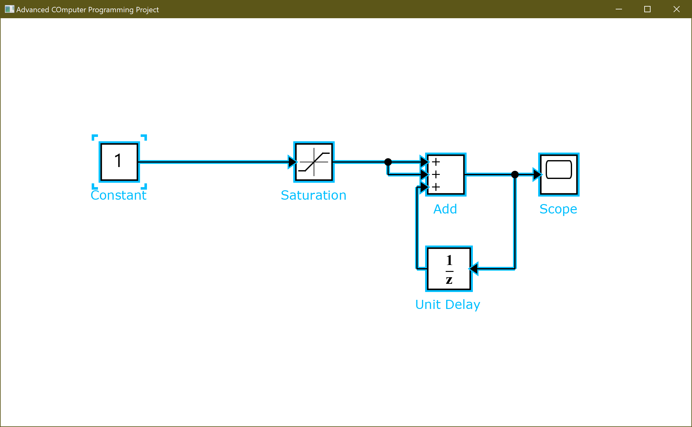

# CSE231s: Advanced Computer Programming
## Final project (JavaFX GUI)
The aim of this project is to develop a software tool that can read Simulink MDL files and display their contents in a user-friendly way using a Java-based graphical user interface (GUI).

### Tasks:
1) Loading and parsing Simulink MDL file and parsing it.
2) Displaying the Simulink model in a hierarchical structure.

### Deliverables:
- Link to the github repository.
- Readme.md file with proper documentation.

---

## File structure:
The code consists of 7 files under `Project/src/main/java/com/project/`:
|File Name|Description|
| -----------|-----------|
|App.java|Contains the main function of the code.|
|Shapes.java|Contains the 5 different block shapes.|
|Block.java|Contains the blocks parsing classes.|
|MyLine.java|Contains the lines parsing classes.|
|Branch.java|Contains the branches parsing classes.|
|FxHelper.arxml|Functions as the API between the parser and the gui.|
|Example.mdl|The file with the Simulink data.|

---

## Code walkthrough:

### 1) Parsing:
A parser class is made to extract data from mdl files concerning blocks, lines and branches.

By looping through the mdl files and searching for the required propertiies, one can get an array list containing all the required blocks and lines to be interpreted by JavaFX.

### 2) The API:
Its main goal is to get the data from the `Parser` class, then return the specific coordinates of each element to be drawn using JavaFX.

All coordinates are calculated in relation to a setpoit which is the top left point of the canvas.

Lines can decide which side to go and theri start and end location by calculating the position of every source and destination block and determining the right port location.

### 3) JavaFX GUI:

Responsible for drawing the blocks by receiving the parameters from the `FxHelper` API the connecting these clocks through lines, branches and arrows.

1)  Constant Block:

Drawing the centered squares, then the bigger square representing the frame , cutting this frame with 2 white squares to reach the final shape and inserting "1"in the middle.

2)  Saturation Block:

Drawing the centered squares , the x,y axes ,2 horizontal lines and 1 last line connecting between the 2 horizontal ones.

3) Add Block:

Drawing the centered squares, inserting 3 "+" through passing no.3 to the method and iterating through a loop to get the final shape.

4) Unit Delay Block:

Drawing the centered squares, inserting 1/z in the middle

5) Scope Block:

Drawing the centered squaers, then drawing a rectangle inside them and rounding the corners

---

## GUI Output:

